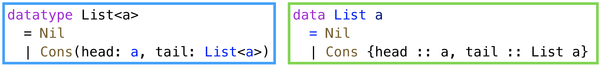
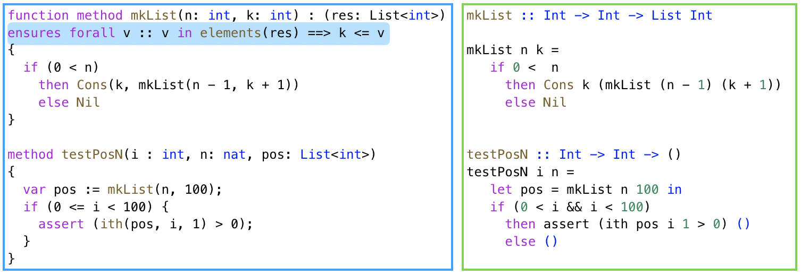
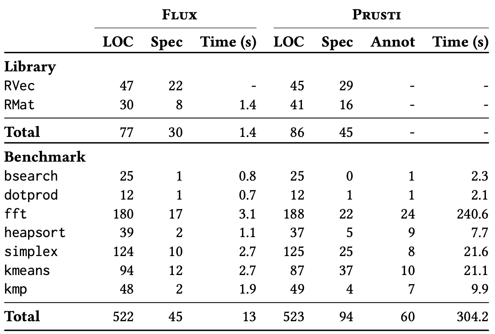
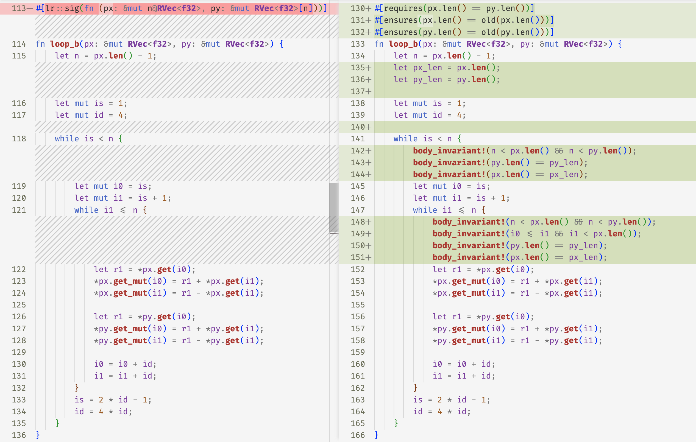
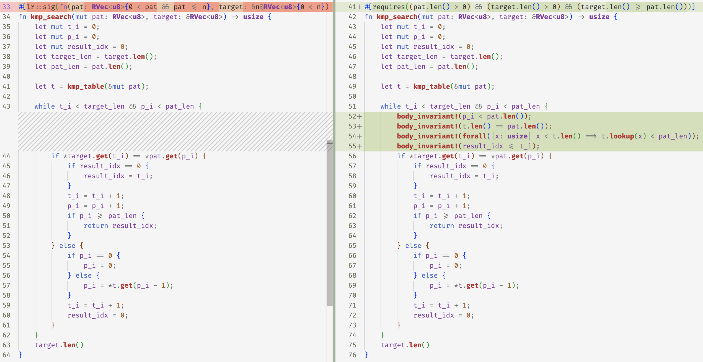

# `Flux`: Liquid types for Rust

**Nico Lehmann**, Adam Geller, Gilles Barthe, Niki Vazou, Ranjit Jhala

---

## Motivation

_Types vs. Floyd-Hoare logic_

## Demonstration

Flux - Liquid Types for Rust

## Evaluation

Flux v. Prusti for Memory safety

---

# Types vs. Floyd-Hoare logic

---

## Liquid/Refinements 101

```haskell
type Nat = {v: Int | 0 <= v}
```

- `Int` is the _base type_ of the value
- `v` names the _value_ being described
- `0 <=v` is a _predicate_ constraint

---

## Liquid/Refinements 101

Generate the sequence of values between `lo` and `hi`

```haskell
range :: lo:Int -> {hi:Int | lo <= hi} -> List {v:Int|lo <= v && v < hi}
```

---

## Liquid/Refinements 101

Generate the sequence of values between `lo` and `hi`

```haskell
range :: lo:Int -> {hi:Int | lo <= hi} -> List {v:Int|lo <= v && v < hi}
```

#### Input Type is a Precondition

`lo <= hi`

---

## Liquid/Refinements 101

Generate the sequence of values between `lo` and `hi`

```haskell
range :: lo:Int -> {hi:Int | lo <= hi} -> List {v:Int|lo <= v && v < hi}
```

#### Output Type is a Postcondition

_Every element_ in sequence is between `lo` and `hi`

---

# Types vs. Floyd-Hoare logic

> Types _decompose_ (quantified) assertions to _quantifier-free_ refinements

---

## Lists in Dafny vs LiquidHaskell

<br>



---

## Accessing the `i`-th List Element


**Floyd-Hoare** requires `elements` and _quantified_ axioms

**Liquid** Parametric _polymorphism_ yields spec for free

---

## Building and Using Lists



**Floyd-Hoare** _Quantified_ postcondition (hard to infer)

---

## Building and Using Lists


**Liquid** _Quantifier-free_ type (easy to infer)

```haskell
Int -> k:Int -> List {v:Int| k <= v}
```

---

# Types vs. Floyd-Hoare logic

Types decompose assertions to quantif-free refinements ...

... but what about **imperative programs**

---

## Motivation

Types vs. Floyd-Hoare logic

## Demonstration

_`Flux` Liquid Types for Rust_

## Evaluation

`Flux` v. `Prusti` for Memory Safety

---

## `Flux` Liquid Types for Rust

`flux` (/flʌks/)

n. 1 a flowing or flow. 2 a substance used to refine metals. v. 3 to melt; make fluid.

---

## `Flux` Liquid Types for Rust

1. [`basics`](src/basics.rs)

2. [`borrows`](src/borrows.rs)

3. [`rvec-api`](src/rvec.rs)

4. [`vectors`](src/vectors.rs)

---

## Motivation

Types vs. Floyd-Hoare logic

## Demonstration

_`Flux` Liquid Types for Rust_

## Evaluation

`Flux` v. `Prusti` for Memory Safety

---

## Evaluation

`Flux` v. `Prusti` for Memory Safety

---

## `Flux` v. `Prusti` by the numbers



---

## `Flux` v. `Prusti` : Types Simplify Specifications

```rust
// Rust
fn store(&mut self, idx: usize, value: T)

// Flux
fn store(self: &mut RVec<T>[@n], idx: usize{idx < n}, value: T)

// Prusti
requires(index < self.len())
ensures(self.len() == old(self.len()))
ensures(forall(|i:usize| (i < self.len() && i != index) ==>
                    self.lookup(i) == old(self.lookup(i))))
ensures(self.lookup(index) == value)
```

**Quantifiers make SMT _slow_!**

---

## `Flux` v. `Prusti` : Types Enable Code Reuse

<br>

### **Example:** `kmeans.rs` in `flux`

<br>

```rust
fn kmeans(n:usize, cs: k@RVec<RVec<f32>[n]>, ps: &RVec<RVec<f32>[n]>, iters: i32) -> RVec<RVec<f32>[n]>[k] where 0 < k
```

- **Point** is an `n` dimensional float-vec `RVec<f32>[n]`

- **Centers** are a vector of `k` points `RVec<RVec<f32>[n]>[k]`

---

## `Flux` v. `Prusti` : Types Enable Code Reuse

<br>

### **Example:** `kmeans.rs` in `prusti`

<br>

```rust
ensures(forall(|i:usize| (i < self.len() && i != index) ==>
                    self.lookup(i) == old(self.lookup(i))))
```

### Value equality _prevents vector nesting!_

Have to duplicate code in new (untrusted) [wrapper library](compare/matwrapper.rs)

---

## `Flux` v. `Prusti` : Types Simplify Invariants & Inference

### Dimension preservation obfuscated by `Prusti` spec

```rust
#[requires(i < self.rows() && j < self.cols())]
#[ensures(self.cols() == old(self.cols()) && self.rows() == old(self.rows()))]
pub fn set(&mut self, i: usize, j: usize, value: T) {
  self.inner[i][j] = value;
}
```

### Hassle programmer for dimension preservation invariants

- `kmeans::normalize_centers` in [prusti](prusti-kmeans.rs) vs. [flux](flux-kmeans.rs)

- `fft::loop_a` in [prusti](prusti-fft.rs) vs. [flux](flux-fft.rs)

---

### Burden programmer with dimension preservation invariants

- `fft::loop_a` in [prusti](prusti-fft.rs) vs. [flux](flux-fft.rs)



---

## `Flux` v. `Prusti` : Types Simplify Invariants & Inference


### Types _decompose_ quantified assertions to _quantifier-free_ refinements

`flux` infers quantifier-free refinements via Horn-clauses/Liquid Typing

---

## `Flux` v. `Prusti` : Types Simplify Invariants & Inference

`kmp_search` in [prusti](prusti-kmp.rs) vs. [flux](flux-kmp.rs)

```rust
// Prusti
body_invariant!(forall(|x: usize| x < t.len() ==> t.lookup(x) < pat_len));

// Flux
t: RVec<{v:v < pat_len}>
```

<br>

### Types _decompose_ quantified assertions to _quantifier-free_ refinements

`flux` infers quantifier-free refinements via Horn-clauses/Liquid Typing

---

### Types _decompose_ quantified assertions to _quantifier-free_ refinements

`kmp_search` in [prusti](prusti-kmp.rs) vs. [flux](flux-kmp.rs)



---

## Motivation

Types vs. Floyd-Hoare logic

## Demonstration

`Flux` Liquid Types for Rust

## Evaluation

_`Flux` v. `Prusti` for Memory Safety_

---

## Conclusions

**Refinements + Rust's Ownership = Ergonomic Imperative Verification...**

- Specify complex invariants by _composing_ type constructors & QF refinements

- Verify complex invariants by _decomposing_ validity checks via syntactic subtyping

---

## Conclusions

**Refinements + Rust's Ownership = Ergonomic Imperative Verification...**

- Specify complex invariants by _composing_ type constructors & QF refinements

- Verify complex invariants by _decomposing_ validity checks via syntactic subtyping

**... But this is just the beginning**

- `Flux` restricts specifications, `Prusti` allows _way_ more ...

- ... how to stretch types to "full functional correctness"?

**What are interesting application domains to focus on?**

---

# `flux` https://github.com/liquid-rust/flux/

```rust
fn init<F, A>(n: usize, mut f: F) -> RVec<A>
where
    F: FnMut(usize) -> A,
{
    (0..n).map(|i| f(i)).collect()
}

fn mk_weights(input_size: usize, output_size: usize) -> RVec<RVec<u64>> {
    let mut rng = rand::thread_rng();
    let weights = init(output_size, |_| {
        init(input_size, |_| 0)
    });
    weights
}

fn max(a: u64, b: u64) -> u64 {
    if a > b {
        a
    } else {
        b
    }
}

fn main() {
    let input_size = 10;
    let output_size = 5;
    let weights = mk_weights(input_size, output_size);
    let mut res = 0;
    for i in 0..output_size {
        for j in 0..input_size {
            res = max(res, weights[i][j]);
        }
    }
}
```
