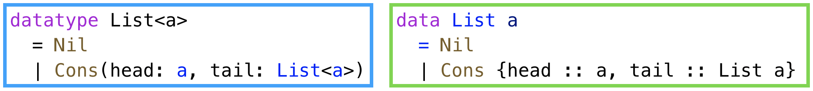
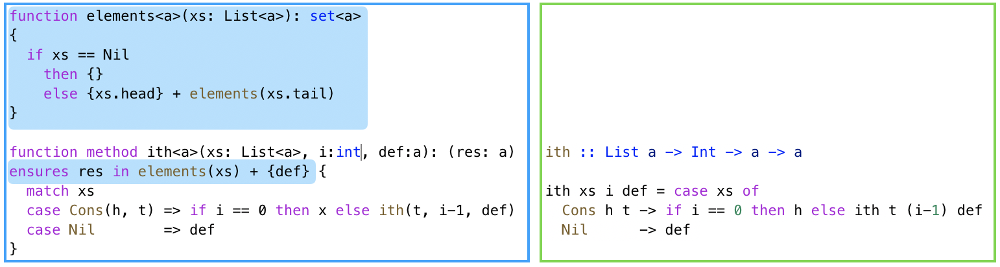
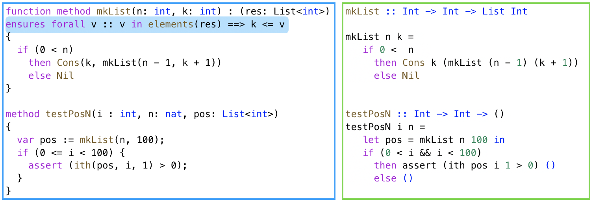

# `Flux`: Liquid types for Rust

---

## Motivation

_Types vs. Floyd-Hoare logic_

## Demonstration
Flux - Liquid Types for Rust

## Evaluation
Flux v. Prusti for Memory safety

---

# Types vs. Floyd-Hoare logic

---

## Liquid/Refinements 101

```haskell
type Nat = {v: Int | 0 <= v}
```

* `Int` is the _base type_ of the value
* `v` names the _value_ being described
* `0 <=v` is a _predicate_ constraint

---

## Liquid/Refinements 101

Generate the sequence of values between `lo` and `hi`

```haskell
range :: lo:Int -> {hi:Int | lo <= hi} -> List {v:Int|lo <= v < hi}
```

---

## Liquid/Refinements 101

Generate the sequence of values between `lo` and `hi`

```haskell
range :: lo:Int -> {hi:Int | lo <= hi} -> List {v:Int|lo <= v < hi}
```

#### Input Type is a Precondition

`lo <= hi`

---

## Liquid/Refinements 101

Generate the sequence of values between `lo` and `hi`

```haskell
range :: lo:Int -> {hi:Int | lo <= hi} -> List {v:Int|lo <= v < hi}
```

#### Output Type is a Postcondition

_Every element_ in sequence is between `lo` and `hi`

---

# Types vs. Floyd-Hoare logic

Types _decompose_ assertions to _quantif-free_ refinements

---

## Lists in Dafny vs LiquidHaskell

<br>



---

## Accessing the `i`-th List Element




**Floyd-Hoare** Requires `elements` and _quantified_ axioms

**Liquid** Parametric _polymorphism_ yields spec for free

---
## Building and Using Lists



**Floyd-Hoare** _Quantified_ postcondition (hard to infer)

---
## Building and Using Lists


**Liquid** _Quantifier-free_ type (easy to infer)

```haskell
Int -> k:Int -> List {v:Int| k <= v}
```

---

# Types vs. Floyd-Hoare logic

Types decompose assertions to quantif-free refinements

... but what about **imperative programs**

---

## Motivation

Types vs. Floyd-Hoare logic

## Demonstration

_`Flux` Liquid Types for Rust_

## Evaluation
`Flux` v. `Prusti` for Memory Safety

---

## `Flux` Liquid Types for Rust

`flux` (/flʌks/) n. 1 a flowing or flow. 2 a substance used to refine metals. v. 3 to melt; make fluid.


---

## `Flux` Liquid Types for Rust

1. [`basics`](src/basics.rs)

2. [`borrows`](src/borrows.rs)

3. [`ref-vec`](src/rvec.rs)

4. [`vectors`](src/vectors.rs)

---

## Motivation

Types vs. Floyd-Hoare logic

## Demonstration

_`Flux` Liquid Types for Rust_

## Evaluation

`Flux` v. `Prusti` for Memory Safety

---

## Quantitative Comparison

Table

---

# Qualitative Comparison

---

## 1. Types Simplify API Specifications

```rust
// Rust
fn store(&mut self, idx: usize, value: T)

// Flux
fn store(self: &mut RVec<T>[@n], idx: usize{idx < n}, value: T)

// Prusti
#[trusted]
#[requires(index < self.len())]
#[ensures(self.len() == old(self.len()))]
#[ensures(forall(|i:usize| (i < self.len() && i != index) ==> self.lookup(i) < old(self.lookup(i))))]
#[ensures(self.lookup(index) == value)]
```

**Boo Quantifiers** Make SMT checking slow

---

## 2. Types Enable API Reuse

* Prevent code reuse

- polymorphism => API composition (`RVec.rs` and `RMat.rs`)

---

## 3. Types Simplify Invariants/Inference

- easy length invariant (due to `RVec::set` and `fft`)

- polymorphism => quantifier-free invariants (`kmp.rs`)
